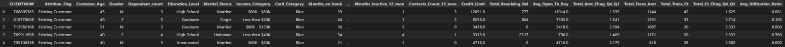

 # Retención de clientes en un banco
Uno de los mayores desafíos para los bancos hoy en día es **evitar que sus clientes abandonen sus productos (churn)**, sobre todo en servicios como las tarjetas de crédito. Cada vez que un cliente deja de usar su tarjeta o cancela el producto, el banco no solo pierde los ingresos de las transacciones, sino también la oportunidad de generar rentabilidad a largo plazo. Además, atraer a un nuevo cliente suele ser **mucho más caro** que retener a uno existente.  

## 📌 CASO PRÁCTICO:
Imaginemos que un banco ficticio llamado **"Banco Horizonte"**, nos ha contratado para abordar este problema. Han observado que un porcentaje considerable de sus clientes está abandonando sus servicios y quieren saber **quiénes podrían estar en riesgo de irse**. Incluso más importante, quieren descubrir **qué acciones podrían tomar para retenerlos**.  

Para resolver esto, el banco nos proporcionará datos de sus clientes, y nuestro proyecto se enfocará en los siguientes tres objetivos principales:  

1. **Predecir la probabilidad de abandono de cada cliente**, identificando quiénes están en riesgo de irse.  
2. **Analizar las causas clave que influyen en la decisión de quedarse o irse**, para entender el comportamiento de los clientes.  
3. **Generar recomendaciones personalizadas** basadas en los datos, como incentivos o mejoras en los servicios, que aumenten la retención y la satisfacción de los clientes.  

--------

##  🎯 Fases del proyecto

### 1. Configuración y carga de datos
- **1.1 Cargar los datos** y separar entre conjunto de entrenamiento y test para poder evaluar nuestros modelos más adelante.

### 2. EDA (Exploración de datos)
- **2.1 Describir estadísticas básicas** para entender el comportamiento general de las variables.  
- **2.2 Visualizar variables** y su distribución.  
- **2.3 Analizar la interacción entre variables** para detectar patrones importantes.  
- **2.4 Estudiar la correlación entre variables** para identificar relaciones relevantes.

### 3. Preprocesamiento de datos
- **3.1 Eliminar variables irrelevantes o redundantes**.  
- **3.2 Tratar valores nulos**  
  - **3.2.1 Imputación basada en lógicas de negocio**.  
  - **3.2.2 Imputación con valores estimados** usando técnicas estadísticas.  
- **3.3 Aplicar one-hot encoding** para variables categóricas y dejar los datos listos para los modelos.

### 4. Balanceo de clases
- **4.1 Ajustar el dataset** para que los modelos no se sesguen hacia la clase mayoritaria.  
- **4.2 Preparar el test** para la evaluación final.

### 5. Entrenamiento y evaluación de modelos
- **5.1 Probar regresión logística** como modelo base.  
- **5.2 Entrenar XGBoost** para mejorar la predicción del churn.

### 6. Interpretación de variables en el modelo
- **6.1 Analizar qué variables influyen más** en la decisión de los clientes de quedarse o irse.  
- **6.2 Extraer conclusiones** que permitan diseñar estrategias de retención.

### 7. Generación de comunicaciones con GPT
- **7.1 Usar IA generativa** para crear mensajes personalizados que animen a los clientes a quedarse.

### 8. Envío de correo
- **8.1 Fase final**: ejecutar la campaña de retención con los clientes identificados como en riesgo.

--------

## 📁 Estructura del Proyecto

```
bank_customer_churn_project/
│
├── data/
│   ├── raw/                 # Dataset original
│   │   └── BankChurners.csv
│   └── processed/           # Dataset limpio y preparado para el análisis y modelado
│
├── notebooks/
│   └── customer_retention_analysis.ipynb  # Notebook principal donde se realiza todo el flujo de trabajo
│
├── src/
│   └── app.py               # Aplicación interactiva para que el banco pueda simular escenarios de retención y tomar decisiones basadas en los datos.  
│
├── images/                  # Gráficos generados en el análisis para documentar y visualizar insights importantes
│   └── dataset.png
│
├── README.md                
└── requirements.txt         # Librerías necesarias para instalar
```

--------
## 🧾 Descripción del Dataset

Este dataset se obtuvo de **Kaggle** y contiene información de los clientes de un banco. Está en formato **CSV** y tiene:  

- **Filas:** 10,127  
- **Columnas:** 21  

Cada fila representa un cliente individual, identificado por un código único (su número de cuenta), e incluye variables demográficas, socioeconómicas y, principalmente, variables relacionadas con el uso de la tarjeta, las transacciones realizadas y la relación del cliente con el banco durante los últimos 12 meses.
La variable objetivo es **Attrition_Flag**, que indica si un cliente ha abandonado el servicio (`Attrited Customer`) o sigue activo (`Existing Customer`).

### Columnas



- **CLIENTNUM**: número de cuenta del cliente. 
- **Attrition_Flag**: estado del cliente (Existing Customer: permanece activo, Attrited Customer: ha abandonado el servicio).
- **Customer_Age**: edad del cliente.
- **Gender**: género del cliente (M: masculino, F: femenino).
- **Dependent_count**: número de personas dependientes del cliente.
- **Education_Level**: nivel educativo del cliente (Sin educación, Escuela Secundaria, Graduado, Universidad, Postgrado, Doctorado y Desconocido). 
- **Marital_Status**: estado civil del cliente (Soltero, Casado, Divorciado y Desconocido).
- **Income_Category**: categoría de ingresos del cliente (Menos de $40K, $40K-$60K, $60K-$80K, $80K-$120K, $120K+ y Desconocido).  
- **Card_Category**: tipo de tarjeta utilizada (Blue, Silver, Gold y Platinum). 
- **Months_on_Book**: tiempo como cliente (en meses)
- **Total_Relationship_Count**: número de productos utilizados por los clientes en el banco.  
- **Months_Inactive_12_mon**: periodo de inactividad en los últimos 12 meses.  
- **Contacts_Count_12_mon**: número de interacciones entre el banco y el cliente en los últimos 12 meses.  
- **Credit_Limit**: límite nominal de transacción de la tarjeta de crédito en un periodo. 
- **Total_Revolving_Bal**: fondos totales utilizados en un periodo.  
- **Avg_Open_To_Buy**: diferencia entre el límite de crédito asignado a la cuenta del titular y el saldo actual.
- **Avg_Utilization_Ratio**: porcentaje de utilización de la tarjeta de crédito.
- **Total_Trans_Amt**: importe total de las transacciones en los últimos 12 meses.
- **Total_Trans_Ct**: número total de transacciones realizadas en los últimos 12 meses.
- **Total_Amt_Chng_Q4_Q1**: incremento del importe de transacciones del cliente entre el cuarto y el primer trimestre.  
- **Total_Ct_Chng_Q4_Q1**: incremento del número de transacciones del cliente entre el cuarto y el primer trimestre. 


--------
## 🛠️ Herramientas utilizadas
En este proyecto se emplean las siguientes herramientas y librerías:

- **Jupyter Notebook**: Para documentar y ejecutar el código de manera organizada.
- **Python**: Para el análisis de datos y modelado de machine learning.
- **Pandas**: Para la manipulación y el análisis de datos estructurados.
- **NumPy**: Para las operaciones matemáticas y el manejo eficiente de arrays.
- **Matplotlib y Seaborn**: Para la visualización de datos, gráficos estadísticos y exploración de patrones.
- **Scikit-learn**: Para el preprocesamiento, el entrenamiento y la evaluación de modelos de clasificación.
- **Streamlit**: Para crear una aplicación web interactiva que permita a los usuarios finales interactuar con el modelo y visualizar predicciones de *churn* de manera sencilla y accesible.

--------


