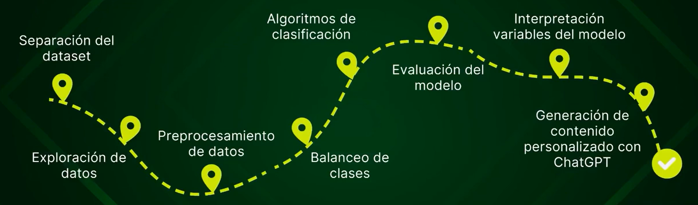

 # Retención de Clientes en un Banco
Uno de los mayores desafíos para los bancos hoy en día es **evitar que sus clientes abandonen sus productos (churn)**, sobre todo en servicios como las tarjetas de crédito. Cada vez que un cliente deja de usar su tarjeta o cancela el producto, el banco no solo **pierde los ingresos** de las transacciones, sino también la oportunidad de **generar rentabilidad a largo plazo**. Además, atraer a un nuevo cliente suele ser **mucho más caro** que retener a uno existente.  

## 📌 CASO PRÁCTICO
Imaginemos que un banco ficticio llamado **"Banco Horizonte"**, nos ha contratado para abordar este problema. Han observado que un porcentaje considerable de sus clientes está abandonando sus servicios y quieren saber **quiénes podrían estar en riesgo de irse**. Incluso más importante, quieren descubrir **qué acciones podrían tomar para retenerlos**.  

Para resolver esto, el banco nos proporcionará datos de sus clientes, y nuestro proyecto se enfocará en los siguientes tres objetivos principales:  

1. **Predecir la probabilidad de abandono de cada cliente**, identificando quiénes están en riesgo de irse.  
2. **Analizar las causas clave que influyen en la decisión de quedarse o irse**, para entender el comportamiento de los clientes.  
3. **Generar recomendaciones personalizadas** basadas en los datos, como incentivos o mejoras en los servicios, que aumenten la retención y la satisfacción de los clientes.  

--------
## 🎯 Fases del proyecto



<table>
  <tr>
    <th>Fase</th>
    <th>Qué se hace</th>
  </tr>

  <tr>
    <td>1️⃣ <b>Separación train-test</b></td>
    <td>
      <ul>
        <li>Cargar los datos</li>
        <li>Separar entre conjunto de entrenamiento y test para poder evaluar los modelos</li>
      </ul>
    </td>
  </tr>

  <tr>
    <td>2️⃣ <b>EDA (Exploración de datos)</b></td>
    <td>
      <ul>
        <li>Describir estadísticas básicas para entender el comportamiento general de las variables</li>
        <li>Visualizar variables y su distribución</li>
        <li>Analizar la interacción entre variables para detectar patrones importantes</li>
        <li>Estudiar la correlación entre variables para identificar relaciones relevantes</li>
      </ul>
    </td>
  </tr>

  <tr>
    <td>3️⃣ <b>Preprocesamiento de datos</b></td>
    <td>
      <ul>
        <li>Eliminar variables irrelevantes o redundantes</li>
        <li>Tratar valores nulos:
          <ul>
            <li>Imputación basada en lógicas de negocio</li>
            <li>Imputación con valores estimados usando técnicas estadísticas</li>
          </ul>
        </li>
        <li>Aplicar one-hot encoding para variables categóricas y dejar los datos listos para los modelos</li>
      </ul>
    </td>
  </tr>

  <tr>
    <td>4️⃣ <b>Balanceo de clases</b></td>
    <td>
      <ul>
        <li>Ajustar el dataset para que los modelos no se sesguen hacia la clase mayoritaria</li>
        <li>Preparar el test para la evaluación final</li>
      </ul>
    </td>
  </tr>

  <tr>
    <td>5️⃣ <b>Entrenamiento y evaluación de modelos</b></td>
    <td>
      <ul>
        <li>Probar regresión logística como modelo base</li>
        <li>Entrenar XGBoost para mejorar la predicción del churn</li>
      </ul>
    </td>
  </tr>

  <tr>
    <td>6️⃣ <b>Interpretación de variables en el modelo</b></td>
    <td>
      <ul>
        <li>Analizar qué variables influyen más en la decisión de los clientes de quedarse o irse</li>
        <li>Extraer conclusiones que permitan diseñar estrategias de retención</li>
      </ul>
    </td>
  </tr>

  <tr>
    <td>7️⃣ <b>Generación de comunicaciones con GPT</b></td>
    <td>
      <ul>
        <li>Usar IA generativa para crear mensajes personalizados que animen a los clientes a quedarse</li>
      </ul>
    </td>
  </tr>

  <tr>
    <td>8️⃣ <b>Envío de correo</b></td>
    <td>
      <ul>
        <li>Ejecutar la campaña de retención con los clientes identificados como en riesgo</li>
      </ul>
    </td>
  </tr>

</table>


--------

## 📁 Estructura del proyecto

```
bank_customer_churn_project/
│
├── data/
│   ├── raw/                 # Dataset original
│   │   └── BankChurners.csv
│   └── processed/           # Dataset limpio y preparado para el análisis y modelado
│
├── notebooks/
│   └── customer_retention_analysis.ipynb  # Notebook principal donde se realiza todo el flujo de trabajo
│
├── src/
│   └── app.py               # Aplicación interactiva para que el banco pueda simular escenarios de retención y tomar decisiones basadas en los datos.  
│
├── images/                  # Gráficos generados en el análisis para documentar y visualizar insights importantes
│   └── dataset.png
│
├── README.md                
└── requirements.txt         # Librerías necesarias para instalar
```

--------
## 🧾 Descripción del dataset

Este dataset se obtuvo de **Kaggle** y contiene información de los clientes de un banco. Está en formato **CSV** y tiene:  

- **Filas:** 10,127  
- **Columnas:** 21  

Cada fila representa un cliente individual, identificado por un código único (su número de cuenta), e incluye variables demográficas, socioeconómicas y, principalmente, variables relacionadas con el uso de la tarjeta, las transacciones realizadas y la relación del cliente con el banco durante los últimos 12 meses. La variable objetivo es **Attrition_Flag**, que indica si un cliente ha abandonado el servicio (`Attrited Customer`) o sigue activo (`Existing Customer`).


- **CLIENTNUM**: número de cuenta del cliente. 
- **Attrition_Flag**: estado del cliente (`Existing Customer`, `Attrited Customer`).
- **Customer_Age**: edad del cliente.
- **Gender**: género del cliente (`M`,`F`).
- **Dependent_count**: número de personas dependientes del cliente.
- **Education_Level**: nivel educativo del cliente (`Uneducated`, `High School`, `Graduate`, `College`, `Post-Graduate`, `Doctorate` y `Unknown`). 
- **Marital_Status**: estado civil del cliente (`Single`, `Married`, `Divorced` y `Unknown`).
- **Income_Category**: categoría de ingresos del cliente (`Less than $40K`, `$40K-$60K`, `$60K-$80K`, `$80K-$120K`, `$120K+` y `Unknown`).  
- **Card_Category**: tipo de tarjeta utilizada (`Blue`, `Silver`, `Gold` y `Platinum`). 
- **Months_on_Book**: tiempo como cliente en meses
- **Total_Relationship_Count**: número de productos utilizados por los clientes en el banco.  
- **Months_Inactive_12_mon**: periodo de inactividad en los últimos 12 meses.  
- **Contacts_Count_12_mon**: número de interacciones entre el banco y el cliente en los últimos 12 meses.  
- **Credit_Limit**: límite nominal de transacción de la tarjeta de crédito en un periodo. 
- **Total_Revolving_Bal**: fondos totales utilizados en un periodo.  
- **Avg_Open_To_Buy**: diferencia entre el límite de crédito asignado a la cuenta del titular y el saldo actual.
- **Avg_Utilization_Ratio**: porcentaje de utilización de la tarjeta de crédito.
- **Total_Trans_Amt**: importe total de las transacciones en los últimos 12 meses.
- **Total_Trans_Ct**: número total de transacciones realizadas en los últimos 12 meses.
- **Total_Amt_Chng_Q4_Q1**: incremento del importe de transacciones del cliente entre el cuarto y el primer trimestre.  
- **Total_Ct_Chng_Q4_Q1**: incremento del número de transacciones del cliente entre el cuarto y el primer trimestre. 


--------
## 🛠️ Herramientas utilizadas
<table>
  <tr>
    <td align="center">
      <br/>
      <b>Python</b>
    </td>
    <td align="center">
      <br/>
      <b>Pandas</b>
    </td>
    <td align="center">
      <br/>
      <b>NumPy</b>
    </td>
    <td align="center">
      <br/>
      <b>Scikit-learn</b>
    </td>
    <td align="center">
      <br/>
      <b>Matplotlib</b>
    </td>
    <td align="center">
      <br/>
      <b>Seaborn</b>
    </td>
   <td align="center">
      <br/>
      <b>Streamlit</b>
    </td>
    <td align="center">
      <br/>
      <b>Jupyter</b>
    </td>
    <td align="center">
      <br/>
      <b>ChatGPT</b>
    </td>
  </tr>
</table>

--------


